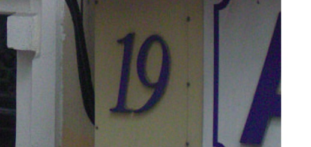

# 一、运行环境安装
一开始首先利用官网conda命令安装pytorch，但是可能由于网络的问题无法下载成功，换了清华源也没有帮助。后来改用pip命令下载，顺利安装成功。
# 二、baseline理解
因为是初次接触pytorch和大段神经网络代码，因此许多语句无法深入理解，现将大体思路梳理如下：
* 1、定义读取图像的数据库
```
class SVHNDataset(Dataset):
 
    def __init__(self, img_path, img_label, transform=None):
        self.img_path = img_path
        self.img_label = img_label 
        if transform is not None:
            self.transform = transform
        else:
            self.transform = None

    def __getitem__(self, index):
        img = Image.open(self.img_path[index]).convert('RGB')

        if self.transform is not None:
            img = self.transform(img)
```
这部分借用了torch.utils.data.dataset中的Dataset模块，定义了读取数据的格式。
* 2、定义好训练数据和验证数据的Dataset
```
train_path = glob.glob('E:0  undergraduate study/CV/input/train/*.png')
train_path.sort()
train_json = json.load(open('E:0  undergraduate study/CV/input/train.json'))
train_label = [train_json[x]['label'] for x in train_json]
print(len(train_path), len(train_label))

train_loader = torch.utils.data.DataLoader(
    SVHNDataset(train_path, train_label,
                transforms.Compose([
                    transforms.Resize((64, 128)),
                    transforms.RandomCrop((60, 120)),
                    transforms.ColorJitter(0.3, 0.3, 0.2),
                    transforms.RandomRotation(5),
                    transforms.ToTensor(),
                    transforms.Normalize([0.485, 0.456, 0.406], [0.229, 0.224, 0.225])
    ])), 
    batch_size=40, 
    shuffle=True, 
    num_workers=0,
)
```
验证数据（val_loader）的定义与训练数据相同。
* 3、定义好字符分类模型，使用renset18的模型作为特征提取模块
```
class SVHN_Model1(nn.Module):
    def __init__(self):
        super(SVHN_Model1, self).__init__()
                
        model_conv = models.resnet18(pretrained=True)
        model_conv.avgpool = nn.AdaptiveAvgPool2d(1)
        model_conv = nn.Sequential(*list(model_conv.children())[:-1])
        self.cnn = model_conv
        
        self.fc1 = nn.Linear(512, 11)
        self.fc2 = nn.Linear(512, 11)
        self.fc3 = nn.Linear(512, 11)
        self.fc4 = nn.Linear(512, 11)
        self.fc5 = nn.Linear(512, 11)
    
    def forward(self, img):        
        feat = self.cnn(img)
        # print(feat.shape)
        feat = feat.view(feat.shape[0], -1)
        c1 = self.fc1(feat)
        c2 = self.fc2(feat)
        c3 = self.fc3(feat)
        c4 = self.fc4(feat)
        c5 = self.fc5(feat)
        return c1, c2, c3, c4, c5
```
这一步搭建神经网络模型，对网络的卷积层、池化层和全连接层函数进行定义。
* 4、定义好训练、验证和预测模块
```
def train(train_loader, model, criterion, optimizer):
    # 切换模型为训练模式
    model.train()
    train_loss = []
    
    for i, (input, target) in enumerate(train_loader):
        if use_cuda:
            input = input.cuda()
            target = target.cuda()
            
        c0, c1, c2, c3, c4 = model(input)
        loss = criterion(c0, target[:, 0]) + \
                criterion(c1, target[:, 1]) + \
                criterion(c2, target[:, 2]) + \
                criterion(c3, target[:, 3]) + \
                criterion(c4, target[:, 4])
        
        # loss /= 6
        optimizer.zero_grad()
        loss.backward()
        optimizer.step()
        
        if i % 100 == 0:
            print(loss.item())
        
        train_loss.append(loss.item())
    return np.mean(train_loss)
```
编写train、valid和predict函数，最终输出是loss损失值。
* 5、迭代训练和验证模型
```
model = SVHN_Model1()
criterion = nn.CrossEntropyLoss()
optimizer = torch.optim.Adam(model.parameters(), 0.001)
best_loss = 1000.0

use_cuda = False
if use_cuda:
    model = model.cuda()

for epoch in range(2):
    train_loss = train(train_loader, model, criterion, optimizer, epoch)
    val_loss = validate(val_loader, model, criterion)
    
    val_label = [''.join(map(str, x)) for x in val_loader.dataset.img_label]
    val_predict_label = predict(val_loader, model, 1)
    val_predict_label = np.vstack([
        val_predict_label[:, :11].argmax(1),
        val_predict_label[:, 11:22].argmax(1),
        val_predict_label[:, 22:33].argmax(1),
        val_predict_label[:, 33:44].argmax(1),
        val_predict_label[:, 44:55].argmax(1),
    ]).T
    val_label_pred = []
    for x in val_predict_label:
        val_label_pred.append(''.join(map(str, x[x!=10])))
    
    val_char_acc = np.mean(np.array(val_label_pred) == np.array(val_label))
    
    print('Epoch: {0}, Train loss: {1} \t Val loss: {2}'.format(epoch, train_loss, val_loss))
    print(val_char_acc)
    # 记录下验证集精度
    if val_loss < best_loss:
        best_loss = val_loss
        torch.save(model.state_dict(), './model.pt')
```
对模型进行训练和验证，得到精度，函数即为步骤4编写的函数，model为步骤3搭建的模型。
* 6、对测试集样本进行预测，生成提交文件
```
test_path = glob.glob('../input/test_a/*.png')
test_path.sort()
test_label = [[1]] * len(test_path)
print(len(val_path), len(val_label))

test_loader = torch.utils.data.DataLoader(
    SVHNDataset(test_path, test_label,
                transforms.Compose([
                    transforms.Resize((64, 128)),
                    transforms.RandomCrop((60, 120)),
                    # transforms.ColorJitter(0.3, 0.3, 0.2),
                    # transforms.RandomRotation(5),
                    transforms.ToTensor(),
                    transforms.Normalize([0.485, 0.456, 0.406], [0.229, 0.224, 0.225])
    ])), 
    batch_size=40, 
    shuffle=False, 
    num_workers=10,
)

test_predict_label = predict(test_loader, model, 1)

test_label = [''.join(map(str, x)) for x in test_loader.dataset.img_label]
test_predict_label = np.vstack([
    test_predict_label[:, :11].argmax(1),
    test_predict_label[:, 11:22].argmax(1),
    test_predict_label[:, 22:33].argmax(1),
    test_predict_label[:, 33:44].argmax(1),
    test_predict_label[:, 44:55].argmax(1),
]).T

test_label_pred = []
for x in test_predict_label:
    test_label_pred.append(''.join(map(str, x[x!=10])))
    
import pandas as pd
df_submit = pd.read_csv('../input/test_A_sample_submit.csv')
df_submit['file_code'] = test_label_pred
df_submit.to_csv('renset18.csv', index=None)
```
# 三、赛题理解
本次大赛利用的是街景图像字符识别，采用公开数据集SVHN，训练集3w张图片，验证集1w张，包括处理后的图像和存储字符位置信息的json文件，测试集不提供json文件。


**原始图片示意**



**json文件坐标信息示意**


如图所示，json中包含了位置框到左上角的坐标以及位置框的长度和宽度，其他还包括**label**，用于表示字符（如9的图像的label为9）


## json文件读取
```python
 import json
train_json = json.load(open('../input/train.json'))

# 数据标注处理
def parse_json(d):
    arr = np.array([
        d['top'], d['height'], d['left'],  d['width'], d['label']
    ])
    arr = arr.astype(int)
    return arr

img = cv2.imread('../input/train/000000.png')
arr = parse_json(train_json['000000.png'])

plt.figure(figsize=(10, 10))
plt.subplot(1, arr.shape[1]+1, 1)
plt.imshow(img)
plt.xticks([]); plt.yticks([])

for idx in range(arr.shape[1]):
    plt.subplot(1, arr.shape[1]+1, idx+2)
    plt.imshow(img[arr[0, idx]:arr[0, idx]+arr[1, idx],arr[2, idx]:arr[2, idx]+arr[3, idx]])
    plt.title(arr[4, idx])
    plt.xticks([]); plt.yticks([])
```     
## 解题思路
 在数据集中一张图片的字符数是不固定的，也就是需要对不定长字符进行识别，这不同于车牌识别等有固定格式的图像识别，也是本次学习的难点。dw为学习者提供了三种思路，从易到难。
* 转化为定长字符识别
 通过观察数据集可以发现，最长的字符串长度为6个，因此可以对每一张图片进行6字符的识别，如果缺失则有X代替，例如234会被识别为234XXX，4674会被识别为4674XX，以此类推。
* 不定长字符识别
 用专门解决不定长字符识别的算法，典型的为CRNN算法
* 位置检测
 由于数据已给出字符的位置信息，因此可以首先构建字符检测模型，判断字符个数，再进行识别。可以参考物体检测模型SSD或者YOLO。
